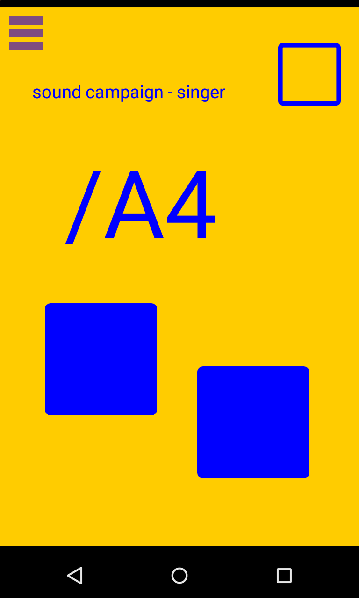
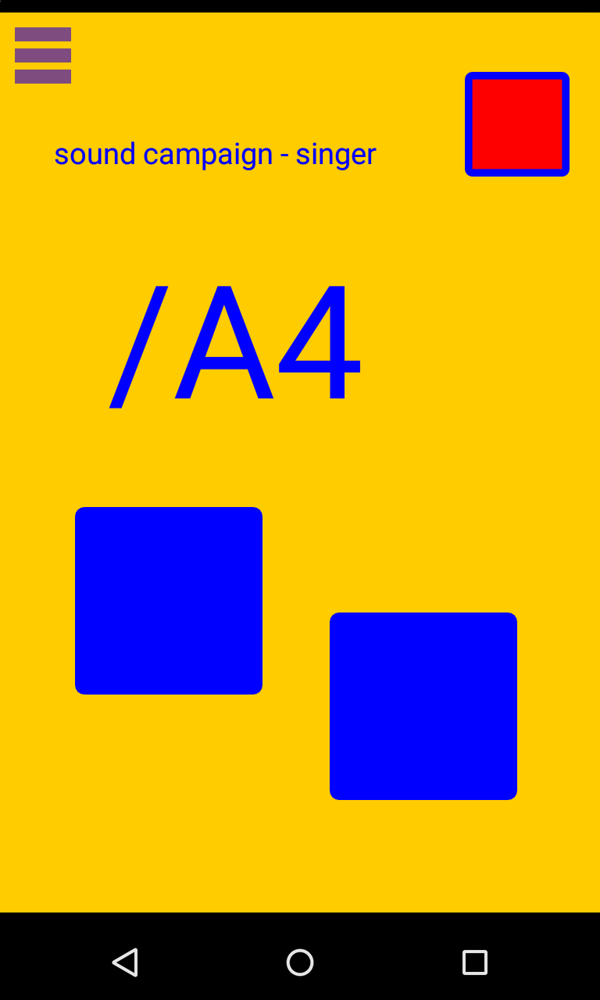
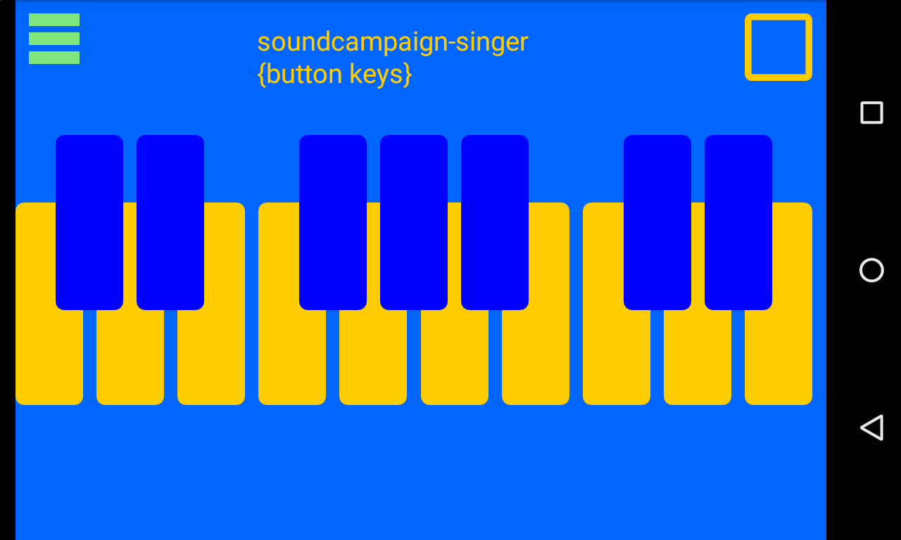
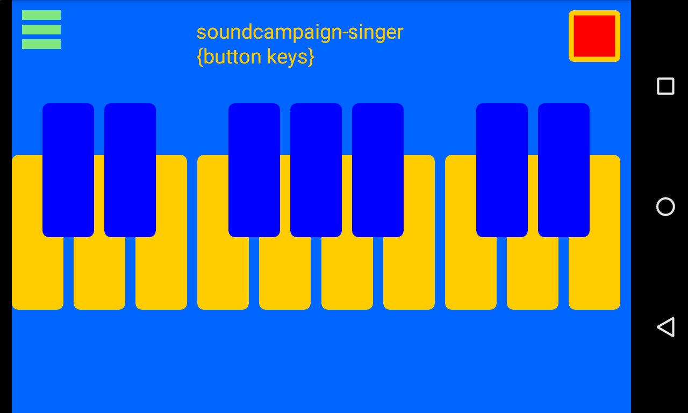
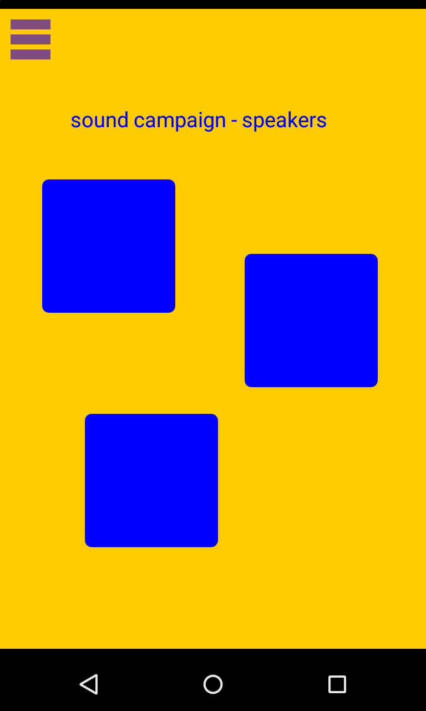

## Phone Harmonic Orchestra 사용 매뉴얼 (작성중, 미완성)

[>> English-version](index-eng.md) (작성중, 없음)

---

### 소개

싱어가 노래를 하거나 건반으로 연주를 하면, 네트워크로 연결된 악기들에서 연주가 됩니다. 악기들도 버튼을 눌러서 연주에 부분적으로 참여합니다. / 스마트폰에 설치하여 사용.

공유기 자치회.

Singer 앱.

<http://ph-orchestra.github.io/soundcampaign-singer-original.zip>
<http://ph-orchestra.github.io/soundcampaign-singer-old-working-just-ok.zip>
<http://ph-orchestra.github.io/soundcampaign-singer-new.zip>

Player 앱.

<http://ph-orchestra.github.io/soundcampaign-singer-keys.zip>

Instruments 앱. (6가지)

<http://ph-orchestra.github.io/soundcampaign-spk-soundshot-voice.zip>
<http://ph-orchestra.github.io/soundcampaign-spk-soundshot-tuba.zip>
<http://ph-orchestra.github.io/soundcampaign-spk-soundshot-piano.zip>
<http://ph-orchestra.github.io/soundcampaign-spk-soundshot-harmonica.zip>
<http://ph-orchestra.github.io/soundcampaign-spk-soundshot-flute.zip>
<http://ph-orchestra.github.io/soundcampaign-spk-soundshot-drumkit.zip>

---

### 설치 단계 (1) - MobMuplat 설치

---

**단계 2 진행전 설치 완료 필수!**

---

### 설치 단계 (2) - 따라하기, 말로만~

1. 해당하는 앱 (뭐뭐.zip) 클릭하여 다운로드
2. 다운로드 된거 (뭐뭐.zip), 클릭하여 열기. 이때, MubMuPlat으로 열기를 선택!
3. 압축 잘 풀려서 잘 설치되었다는 메세지 확인.
4. 잠시 앱에서 나가서, 공동의 공유기(다들 모이기로한 공유기)에 연결되어있는지 확인하고 연결.
5. 다시 앱에 들어와서, 좌측 상단의 i 모양 아이콘 클릭
6. 메뉴버튼(기기마다 표시형태가 다름)을 누르고, Network항목 클릭. LANdini 탭을 선택하고 스위치를 켬.
7. 메뉴버튼 누르고, Documents항목 클릭, 나타난 목록 중, (다운로드한 파일명).mmp란 파일을 클릭

---

### 액션 - 따라하기, 말로만~

a. 악기인 경우는 더이상 할 일은 없고, 버튼을 눌러서 어떤 소리가 들어있는지 확인하고 적절히 연주에 참여하면 됨.
b. 싱어인 경우는 마이크에 대고 노래를 한다. 화면에서 음정인식을 확인할 수 있으며, 우측 상단에 작은 네모를 눌러 네트워크 방송을 켜고 끌 수있다. 켠 상태로 노래할 때, 다른 악기들이 연주되는지 확인하고 이 후, 노래로 악대를 지휘하면 됨.
c. 건반인 경우는 화면에 나타난 건반을 연주한다. 우측 상단에 작은 네모를 눌러 네트워크 방송을 켜고 끌 수있다. 켠 상태로 노래할 때, 다른 악기들이 연주되는지 확인하고 연주로 악대를 지휘.

---

### 참고 내용

- 연락처 및 정보 : <http://dianaband.info>

- Git repository : <https://github.com/ph-orchestra/ph-orchestra.github.io>

---

Experimental

<http://ph-orchestra.github.io/ph-orchestra-singer-keys.zip>
<http://ph-orchestra.github.io/ph-orchestra-singer.zip>
<http://ph-orchestra.github.io/ph-orchestra-inst.zip>
